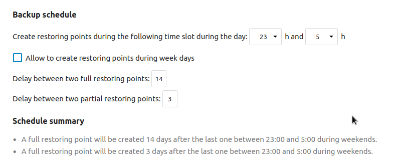
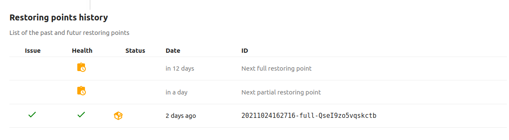
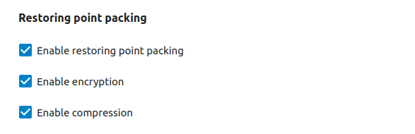
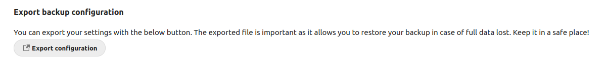
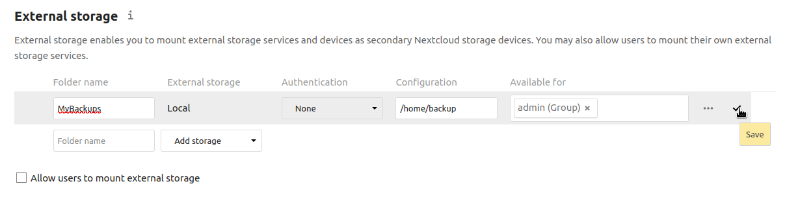
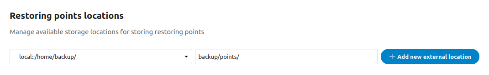
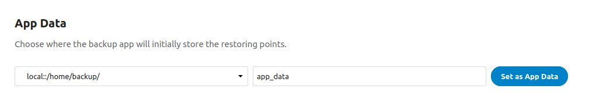

# Backup

This App creates and stores backup images of your Nextcloud.

_(Documentation is still in writing)_

- [Important notes](#notes)
- [Restoring Points](#restoring-point)
- [Hardware Requirement](#hardware)
- [How the Backup App manage your data](#backup-manage-data)
- [Export configuration](#export)
- [Important details about your data](#important)
- [Upload packed backup to External Storages](#external-storages)
- [Quick compression during 1st pass](#zlib-chunk)
- [AppData on External Storage](#external-appdata)
- [Restoring a backup](#restoring)
- [Available `occ` commands](#occ)
- [Faq](#faq)
- [Known issues](#known-issues)

<a name="notes"></a>

## Important notes

- **Read the full documentation**,
- During the generation of the backup, the app will put your instance in `maintenance mode`,
- This app generates a lot of data and can fill your hard drive,
- By default, **your data are encrypted** meaning you **will need to export** the configuration of the
  App **as soon as possible** or you will **not** be able to **decrypt your backups**.

<a name="restoring-point"></a>

## Restoring Points

A restoring point is an image of your Nextcloud at a specific time. A restoring point can be:

- '**Full**' (or Complete) and contains a backup of :
    * The instance of Nextcloud, its apps and `config/config.php`,
    * A dump of the database,
    * The local folder defined as `data` of the Nextcloud.


- '**Partial**' (or Differential) that contains a backup of :
    * The instance of Nextcloud, its apps and `config/config.php`:
        * A dump of the database,
        * Local data that have been modified/generated since the last **Full Backup**.

### What data are available in a Restoring Point

Let's first start with the fact that the **Backup App** will not store **ALL** data from your
Nextcloud.  
As an example, remote files won't be stored.

This is a list of what can be restored and what cannot be restored when using the **Backup App**:

A restoring point will store:

- Your current Nextcloud,
- The configuration in `config/config.php`,
- The `apps/` folder and any other `custom_apps/`,
- Your local `data/`, defined by `'datadirectory'` in `config/config.php`,
- A full `sqldump` of your database,
- List of files and localisation within the backup,
- Metadata about the instance.

A restoring point will **NOT** store:

- Data from External Storages, even if the mounted filesystem is available locally.

### Metadata

Each Restoring Point includes a file named `restoring-point.data` that contains metadata about the
backup:

- Version of your Nextcloud,
- The ID of the parent backup in case of partial backup,
- The list of data file that compose the restoring point, the format for this data depends on the current
  status of the restoring point (packed/unpacked) and the settings (compression, encryption),
- Absolute paths for each data file,
- Checksum for each file of the backup itself,
- The date of the restoring point,
- Comments,
- Information related to the health of the files during the last check.

While the file `restoring-point.data` is require to confirm the integrity of all files and parts of the
backup, it is still possible to generate a restoring point based on the available files. However :

- There is no way to confirm the integrity of the restoring point,
- The restoring process will require some knowledge from the admin about the original infrastructure from
  The original instance that generated the backup.

**Generate Metadata from backup files**

- Upload the files of your restoring point on your instance of Nextcloud with the Backup App installed,
  in a **specific** folder in your Files,
- At the root of this **specific** folder, create a file named `restoring-point.data` with this content:

       {"action": "generate", "id": "20211023234222-full-TFTBQewCEdcQ3cS"}

- Customize your `id`; while it is advised to use the correct **Id** of the **Restoring Point** (if
  known), any string would work. If kept empty, a new **Id** will be generated using the current time,

- Right-click the file `restoring-point.data` and select `Scan Backup Folder`.

After few seconds, the metadata file will be generated and stored within the same `restoring-point.data`
itself.

<a name="hardware"></a>

## Hardware requirement

- **Diskspace**: Creating and storing backups require a lot, **a lot**, of disk-space,


- **AES Hardware Acceleration**: If your processor does not
  support [AES instruction set](https://en.wikipedia.org/wiki/AES_instruction_set), the encryption
  process will fall back to `aes-256-cbc`.  
  This should only affect you if using the Backup App to migrate your instance from an AES-supporting CPU
  to a non-AES-supporting CPU (ie. old arm proc). Enforcing the use of `aes-256-cbc` before the packing
  of the restoring point on a AES-supporting CPU will fix this:

    - Run: `./occ config:app:set backup force_cbc --value '1' `,
    - Pack the restoring point: `./occ backup:point:pack <pointId>`.

<a name="backup-manage-data"></a>

## Configure the handle of your data

### The timing

From the **Admin Settings**/**Backup** page, you can configure the time slot and the rate for the
generation of your future backups:



The time slot define the time of the day the Backup App might run its **1st pass** to generate a backup,
it is based on the local time on the server.

Keep in mind that, when generating a new backup, your instance will be in `maintenance mode` for the full
duration of the **1st pass**. This is the reason why, by default, **Full Backup** will only be started
during the week-end, while **Partial Backup** are also run during week days.

If you scroll down to the bottom of this page, you can have an estimation of the date for your next
backup based on your settings:



### The first pass (the backup process)

During the **First Pass**, data are quickly stored in the `appdata` folder of the **Backup App**.   
At this point, there is no compression nor encryption; the first pass needs to be as fast as possible to
release the `maintenance mode` on the instance.   
The data are stored in a list of zip files (named `chunk`), each one with a maximum size of 4GB (unless
it contains a file bigger than 4GB).

Because there is no compression during the first pass, the `appdata` folder of the **Backup App** will
require at least the same size of your current setup of Nextcloud: the content of the `core`, its `apps`
and `local data`.

By default, the `appdata` folder of the Backup App is located in the same folder than the rest of the
data of your instance defined in `datadirectory`. It is estimated that the `Backup App` needs 65% of the
available diskspace of the `datadirectory`

In case there is not enough space, you can:

- [Mount an External Storage](#external-appdata) and move the `appdata` folder of the **Backup app**
  there.

<!---
- [add a quick compression](#zlib-chunk) during the 1st pass.
-->

### The second pass (the packing process)

The second pass does not require to put your instance in `maintenance mode`. The 2nd pass consist in the
packing of the restoring point and eventually its upload on external storage.

You can configure the type of packing in the Admin Settings of the app:



The packing will list each `chunk` of your backup and:

- Compress them (if enabled),
- Split the result in multiple files (named `part`) of 100MB,
- Encrypt each `part` (if enabled),
- Once completed without issue, remove the original zip file of the `chunk` to free space.

<a name="handle-external-storages"></a>

### Storing on a different hard drive

Once packed, restoring points can be stored on a different location. Locally or remotely.

if [configured](#external-storages), the Backup App will start storing your restoring points externally,
and check their integrity every day.

The uploading process will check that each `part` of the packed restoring point are healthy, based on the
checksum stored in the `metadata` file and will retry to upload any faulty `part`.  
On top of that, the content from the `metadata` file is signed, making the Backup App able to confirm the
full integrity of the backup.

<a name="export"></a>

## Exporting your configuration



<a name="important"></a>

## Important details about your data

- **Disk-space**: The 1st pass does not compress anything, meaning that you will need at least the
  equivalent of currently used space by your Nextcloud as available disk-space. If you have no disk-space
  available, you can configure the app to use
  an [external storage to store all its data](#external-appdata).

<!---
  or add a [quick compression](#zlib-compression) on the `chunks`.
-->

- **Temporary Files**: during the 2nd pass (packing process), the compression and encryption require the
  creation of temporary files. while those files are temporary and deleted when they become useless, they
  are still available for few seconds. Meaning that the temp directory should not be shared with other
  application.


- **Export your setup**: If the option is not disabled, backups are encrypted with a key that is stored
  in the database of your current instance of Nextcloud. The key is mandatory to recover any data from
  your backups.

  You can export your setup from the Admin Settings/Backup page, or using `occ`. If encrypted, the export
  process will generate and returns its own key that will be required during the import when restoring
  your instance. As an admin, you will need to store the export file and its key, preferably in different
  locations.


- **.nobackup**: The presence of a `.nobackup` file in a folder will exclude all content from the current
  folder and its subfolders from the backup.

<a name="external-storages"></a>

## Upload to External Storages

Uploading your packed restoring point on one (or multiple) external storages is the perfect solution when
facing a huge loss of data from your disk whether it is of human or hardware origin.

Those external data are [fully managed](#handle-external-storages) by the app itself.

The configuration is done in 2 steps:

- The first step is to setup a folder from the **External Storage** Settings Page, it is strongly adviced
  to limit the availability of the folder to the `admin` group only:



- The second step is done in the **Backup** Settings Page, the configured External Storage should be
  displayed in the listing of available storage location:



- Set the folder where to store your backup files on the external storage, and click on '_Add new
  external location_'.

<!---

<a name="zlib-chunk"></a>

## Quick compression during 1st pass

If you have limited disk-space available, you can define a compression level (from 0 to 9, with 0 means
no compression) that will be applied to the `chunks` during the 1st pass. This will require more
resources, meaning that the maintenance mode will be enabled for a longer period of time, depends on the
chosen compression level.
-->

<a name="external-appdata"></a>

## AppData on External Storage

If you have no disk-space available, you can configure the app to use an external storage to store all
its data:

- The data generated during the 1st pass are not encrypted, Your data leaves the internal data folder
  from your instance and are now available on an external storage,
- The 1st-pass will require more resources and your instance will stays in maintenance mode for a longer
  time,
- If your external storage is not a local folder, huge network resources will be required,
- During the configuration, old restoring points from the previous storage will be deleted.

From a terminal, run `./occ backup:external:appdata` and follow the instructions to select the external
storage and the folder.  
From the **Backup** Settings Page, you can do the same:



<a name="restoring"></a>

## Restoring a backup

You can restore a single file or the whole instance to a previous state:

    ./occ backup:point:restore <pointId> [--file <filename>] [--data <dataPack>] [--chunk chunkName]

Please note that you can go back to a previous backup of your instance from any version of Nextcloud
compatible with the Backup App. There is no need to install the exact same version as it will be reverted
to the one used when creating the Restoring Point. Meaning that you can fully restore your instance of
Nextcloud even if you lost your harddrive, as long as you kept a copy of the Restoring Point (upload to
another remote instance).

### Restoring my Nextcloud from scratch.

In this scenario, you have lost everything and want to fully recover your Nextcloud.

The first step would be to have a basic setup of Nextcloud+Backup:

- Install a version of Nextcloud compatible with the Backup App,
- Install the **Backup** App,
- Import your `setup` that contains the signature and encryption keys from your previous instance. You
  can bypass this step only if your backup are not encrypted and you do not need the ability to confirm
  the integrity of files:
    * `./occ backup:setup:import [--key <key>] < ~/backup_setup`
- [Enable and Configure the External Storage](#upload-to-external-storages) App, if your backups are on a
  external storage.

Then, you have to add your last valid restoring points from your previous instance. Both the last
Full-Backup and the last Partial-Backup you have in hand:

- [Restoring my Nextcloud from a remote storage](#restore-remote-storage)
- [Restoring my Nextcloud from my workstation](#restore-workstation)

<a name="restore-remote-storage"></a>

### Restoring my Nextcloud from a remote storage

If your backups are on an external storage, assuming you have already configured it in both **External
Storage** and **Backup**, your restoring points should already be available.

_Note: there is a known issues that might require you to browse the root of your Nextcloud Files after
the creation of the external storage._

- List your available restoring points:

```
$ ./occ backup:point:list
- Retrieving data from local
- Retrieving data from external:3
> Found RestoringPoint 20211031232710-full-Tu4H6vOtxKoLLb9
> Found RestoringPoint 20211101014009-full-QeTziynggIuaaD2
+---------------------------------------+---------------------+--------+---------+-----------------------------+------------+--------------+--+
| Restoring Point                       | Date                | Parent | Comment | Status                      | Instance   | Health       |  |
+---------------------------------------+---------------------+--------+---------+-----------------------------+------------+--------------+--+
| A 20211031232710-full-Tu4H6vOtxKoLLb9 | 2021-10-31 23:27:10 |        | beta2   | packed,compressed,encrypted | external:3 | 12H, 23M ago |  |
|  20211101014009-full-QeTziynggIuaaD2  | 2021-11-01 01:40:09 |        |         | packed,compressed,encrypted | external:3 | 10H, 53M ago |  |
+---------------------------------------+---------------------+--------+---------+-----------------------------+------------+--------------+--+
```

- Download the one you want to restore; if you want to restore multiple backups, it is a good idea to
  download them all at that point:

```
$ ./occ backup:point:download 20211031232710-full-Tu4H6vOtxKoLLb9 --external 3
> downloading metadata
check health status: 0 correct, 43 missing and 0 faulty files
  * Downloading data/data-0540e4d6-9d7f-4c84-a8d8-ca40764257d1/00001-B57XWKJQe5Xg1sd: ok
  * Downloading data/data-0540e4d6-9d7f-4c84-a8d8-ca40764257d1/00002-PXHPeS6t6OXFwkP: ok
[...]
```

- Unpack the downloaded restoring point:

```
$ ./occ backup:point:unpack 20211031232710-full-Tu4H6vOtxKoLLb9
Unpacking Restoring Point 20211031232710-full-Tu4H6vOtxKoLLb9
 > lock and set status to unpacking
 > Browsing RestoringData data
   > Unpacking RestoringChunk data-0540e4d6-9d7f-4c84-a8d8-ca40764257d1: proceeding
     * Copying parts to temp files
       - 00001-B57XWKJQe5Xg1sd: /tmp/phpNnYCbZ
       - 00002-PXHPeS6t6OXFwkP: /tmp/phpYqRSPW
[...]
```

- Start the restoring process. Please note that:
    * For each data pack, you will be able to choose the location of the extraction, (you can bypass
      using `--do-not-ask-data`),
    * If a sqldump is available, you will be prompt to use the current configuration from the instance,
      the one from the `config/config.php` freshly restored or use another database (you can bypass
      using `--do-not-ask-sql`),
    * If the information from the file `config/config.php` are in conflict with the path or sql settings
      specified during the extraction, you will be notified that the restoring process wants to update
      them:

```
$ ./occ backup:point:restore 20211031232710-full-Tu4H6vOtxKoLLb9
Restoring Point: 20211031232710-full-Tu4H6vOtxKoLLb9
Date: 2021-10-31 23:27:10
Checking Health status: ok


WARNING! You are about to initiate the complete restoration of your instance!
All data generated since the creation of the selected backup will be lost...

Your instance will come back to a previous state from 13 hours, 17 minutes and 48 seconds ago.

Do you really want to continue this operation ? (y/N) 
```

<a name="restore-workstation"></a>

### Restoring my Nextcloud from my workstation

If your backups are on your workstation, you can upload them on your Nextcloud Files, on your own
Nextcloud account. Once uploaded, open the folder containing the restoring point to find the metadata
file `restoring-point.data`.

Right-click the file `restoring-point.data` and select `Scan Backup Folder`.

The scan of the restoring will be initiated at the next tick of your crontab. The background job will
scan the full folder and its content, copy pertinent data into the app's appdata and create a new entry
in the database.

Once available in the listing of your available restoring points, the process will be the same as
described in [Restoring my Nextcloud from Appdata](#restore-appdata).

<a name="restore-scan"></a>

### Restoring my Nextcloud from AppData

After restoring a previous restoring point, you can face a situation where some restoring points are
available in your `appdata` but not displayed in the listing. This de-synchronisation can be fixed by
running `./occ backup:point:scan`. This will scan your appdata and add the restoring points to your
current database.

Once available in the listing, you can have a better overview of the current status of the restoring
point:

```
$ ./occ backup:point:list
+---------------------------------------+---------------------+--------+---------+-----------------------------+------------+--------------+--+
| Restoring Point                       | Date                | Parent | Comment | Status                      | Instance   | Health       |  |
+---------------------------------------+---------------------+--------+---------+-----------------------------+------------+--------------+--+
| A 20211031232710-full-Tu4H6vOtxKoLLb9 | 2021-10-31 23:27:10 |        | beta2   | packed,compressed,encrypted | external:3 | 15H, 36M ago |  |
|  20211101014009-full-QeTziynggIuaaD2  | 2021-11-01 01:40:09 |        |         | not packed                  | local      | 1H, 13M ago  |  |
+---------------------------------------+---------------------+--------+---------+-----------------------------+------------+--------------+--+
```

In order to restore a backup, the restoring point needs to be `not packed`, if the restoring point you
want to restore has the `packed` status, you will need to `unpack` it first:

```
$ ./occ backup:point:unpack 20211031232710-full-Tu4H6vOtxKoLLb9
Unpacking Restoring Point 20211031232710-full-Tu4H6vOtxKoLLb9
 > Lock and set status to unpacking
 > Browsing RestoringData data
   > Unpacking RestoringChunk data-0540e4d6-9d7f-4c84-a8d8-ca40764257d1: proceeding
     * Copying parts to temp files
       - 00001-B57XWKJQe5Xg1sd: /tmp/phpNnYCbZ
       - 00002-PXHPeS6t6OXFwkP: /tmp/phpYqRSPW
[...]
```

On your restoring point is marked as `not packed` you can proceed to the restoring. Please note that:

* For each data pack, you will be able to choose the location of the extraction, (you can bypass
  using `--do-not-ask-data`),
* If a sqldump is available, you will be prompt to use the current configuration from the instance, the
  one from the `config/config.php` freshly restored or use another database (you can bypass
  using `--do-not-ask-sql`),
* If the information from the file `config/config.php` are in conflict with the path or sql settings
  specified during the extraction, you will be notified that the restoring process wants to update them:

```
$ ./occ backup:point:restore 20211031232710-full-Tu4H6vOtxKoLLb9
Restoring Point: 20211031232710-full-Tu4H6vOtxKoLLb9
Date: 2021-10-31 23:27:10
Checking Health status: ok


WARNING! You are about to initiate the complete restoration of your instance!
All data generated since the creation of the selected backup will be lost...

Your instance will come back to a previous state from 13 hours, 17 minutes and 48 seconds ago.

Do you really want to continue this operation ? (y/N) 
```


<a name="restoring-partial"></a>

### Restoring part of my Nextcloud


<a name="occ"></a>

## Available `occ` commands:

### Export/Import the configuration of your app.

It is **mandatory** to export the configuration of the app as it contains the encryption keys for your
encrypted backup and you will not be able to restore your backups from a data lost.

You can do that from the Admin Settings page or using the `occ` command:

    ./occ backup:setup:export [--key] > ~/backup.setup

This will create the file `~/backup.setup`.  
When using the option `--key` the setup will be encrypted and an `encryption_key` will be generated and
returned by the occ command. This key needs to be stored somewhere and will be required to decrypt the
saved configuration.  
It is strongly (again) advised to use the `--key` option.

To restore the exported configuration:

     ./occ backup:setup:import [--key encryption_key] < ~/backup.setup

It is **mandatory** to export the configuration of the app as it contains the encryption keys for your
encrypted backup and you will not be able to restore your backups from a data lost.

You can do that from the Admin Settings page or using the `occ` command:

    ./occ backup:setup:export [--key] > ~/backup.setup

This will create the file `~/backup.setup`.  
When using the option `--key` the setup will be encrypted and an `encryption_key` will be generated and
returned by the occ command. This key needs to be stored somewhere and will be required to decrypt the
saved configuration.  
It is strongly (again) advised to use the `--key` option.

To restore the exported configuration:

     ./occ backup:setup:import [--key encryption_key] < ~/backup.setup

### Manage your restoring point

**Create a new Restoring Point**

While this is managed by a background job, you can still generate a restoring point manually:

    ./occ backup:point:create [--differential]

The `--differential` option will create an differential backup.

**Upload a Restoring Point**

    ./occ backup:point:upload <pointId>

This will request all configured remote instances to check the sanity of any previous upload for this
Restoring Point, and will only upload missing/faulty file.

**List restoring points**

    ./occ backup:point:list

You can search and compare restoring point available locally and on configured remote instance.

**Search for a specific file:**

    ./occ backup:file:search [--since|--until|--point] <string>

Search for a file, based on its name.

Example: `./occ backup:file:search test.jpg --since 2021-09-23`

**History of specific a file:**

    ./occ backup:file:history [--since|--until] <dataPack> <fullPath>

Display the history of a file.

Example: `./occ backup:file:history data cult/files/backup1.md`

**Import a Restoring Point**

If you start using the app, you will face at one point a situation where an important Restoring Point is
available somewhere but cannot be find in your database. As an example, when restoring a Backup, all
Restoring Point created after this backup won't be in database anymore. This is normal as restoring the
backup fully overwrite your database. In that case, you can run this command:

    ./occ backup:point:scan <pointId>

If it cannot be found, you will need to manually copy the folder that contains the Restoring Point in the
appdata folder: `data/appdata_qwerty123/backup/`.

**Verify integrity of a Restoring Point**

    ./occ backup:point:details <pointId>

## Exporting configuration

This is an important step of your configuration of the Backup App Some information will be needed in case
you start storing your backup on remote instances:

- The identity of your Nextcloud,
- The encryption key used to encrypt your backup.

**While the identity can be changed and your access to the remote files can be restored by executing some
command on the remote instance to update your new identity, a missing encryption key means that your
remote backup cannot be decrypted and are totally useless.**

**Please note that creating a new identity will disable the sanity check on the metadata file.**

    ./occ backup:setup:export [--key] > ~/backup_setup.json

Using the `--key` option will generate a Key, used to encrypt/decrypt the data of your setup. The key
generated during the export of your setup needs to be stored somewhere safe!

    ./occ backup:setup:import [--key <key>] < ~/backup_setup.json

<a name="faq"></a>

## Questions ?

**- Can the app be used to migrate an instance of Nextcloud ?**

Yes, during the restoration you can change the absolute path of your files and the configuration relative
to the database.  
No, you cannot switch the type of the database server (mysql, postgres, ...).

However, the app should not be used to duplicate setup in production as each instance will be fully
identical (`instanceid`, ...).

<a name="known-issues"></a>

## Known issues:

* When adding a new external storage from the files_external, the folder needs to be mounted using the
  Files App. Browsing the root folder should be enough.
